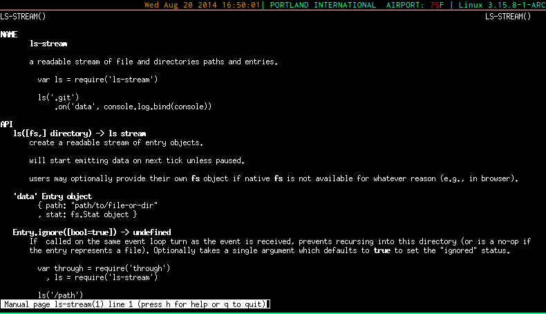

man-modules
===========

Generate man pages for all of your node modules

[](https://npmjs.com/npm/draft-dodger/)

## Installing

`npm install man-modules`

You can also generate man pages for all globally installed `man-modules` if
installed globally.

## Usage

``` shell

$ man-modules

```

Or add it for postinstall in your package.json

``` json
  "main": "index.js",
  "scripts": {
    "postinstall": "man-modules && node app.js",

```

Make sure to add the new path to your `~.bashrc` after running.
``` bash

echo "MANPATH=:/home/meandave/Code/man-modules/node_modules/.man; export MANPATH" >> ~/.bashrc'

```
This will be printed into the terminal after running `man-modules`.



## manpage numbers

The numbers generated for each manpage does not currently mimmick manpage functionality
entirely.

On unix systems these stand for:

1. General commands
2. System calls
3. C library functions
4. Special files (usually devices, those found in /dev) and drivers
5. File formats and conventions
6. Games and screensavers
7. Miscellanea
8. System administration commands and daemons

Where as here, we are simply incrementing for each readme packaged with the project
to ensure no loss of information.

I would like to find a more standard way to handle this. Possibly checking for a `bin`
key in the `package.json` to signify an executable. Or simple concatting these files
together into one big `modulename.1` file.

If you have any suggestions for this please open an issue!

## LICENSE
[MIT](https://github.com/meandavejustice/man-modules/raw/master/LICENSE)
